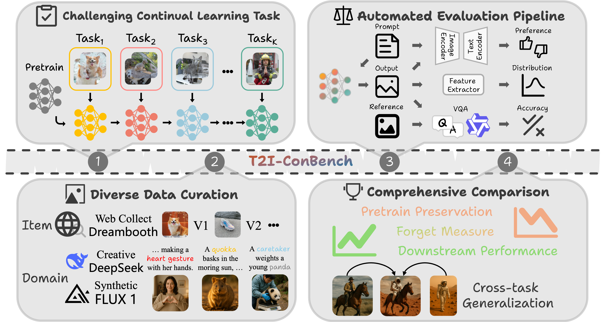

# 
 T2I-ConBench: Text-to-Image Benchmark for Continual Post-training 

<!-- > This repository contains code for the paper [Unified Gradient-Based Machine Unlearning with Remain Geometry Enhancement](https://arxiv.org/pdf/2409.19732v1) by Zhehao Huang, Xinwen Cheng, JingHao Zheng, Haoran Wang, Zhengbao He, Tao Li, Xiaolin Huang. -->

<table align="center">
  <tr>
    <td align="center"> 
       
       
      <em style="font-size: 18px;"><strong style="font-size: 18px;"><strong>Overview of T2I-ConBench.</strong> Our benchmark consists of four components: (1) challenging continual post‑training task sequences, (2) the curation of diverse item and domain datasets, (3) an automated evaluation pipeline, and (4) comprehensive metrics to fully assess each continual learning method's ability to update knowledge, resist forgetting, and generalize across tasks.</em>
    </td>
  </tr>
</table>

# Abstract 
Continual post‑training adapts a single text‑to‑image diffusion model to learn new tasks without incurring the cost of separate models, but naïve post-training causes forgetting of pretrained knowledge and undermines zero‑shot compositionality. We observe that the absence of a standardized evaluation protocol hampers related research for continual post‑training. To address this, we introduce <strong>T2I‑ConBench</strong>, a unified benchmark for continual post-training of text-to-image models. T2I-ConBench focuses on two practical scenarios, <em>item customization</em> and <em>domain enhancement</em>, and analyzes four dimensions: (1) retention of generality, (2) target-task performance, (3) catastrophic forgetting, and (4) cross-task generalization. It combines automated metrics, human‑preference modeling, and vision‑language QA for comprehensive assessment. We benchmark ten representative methods across three realistic task sequences and find that no approach excels on all fronts. Even joint "oracle" training does not succeed for every task, and cross-task generalization remains unsolved. We release all datasets, code, and evaluation tools to accelerate research in continual post‑training for text‑to‑image models.

# TODO
- [ ] item customization 
    - [x] non-lora
    - [ ] lora
- [ ] domain enhancement
    - [ ] non-lora
    - [ ] lora
- [ ] item-domain adaptation
    - [ ] non-lora
    - [ ] lora
- [ ] evaluation
- [ ] README

# 🔥 Getting Started 

* [Continual Post-training and Inference](train) 

* [Evaluation](eval) 

# 📚 Citation