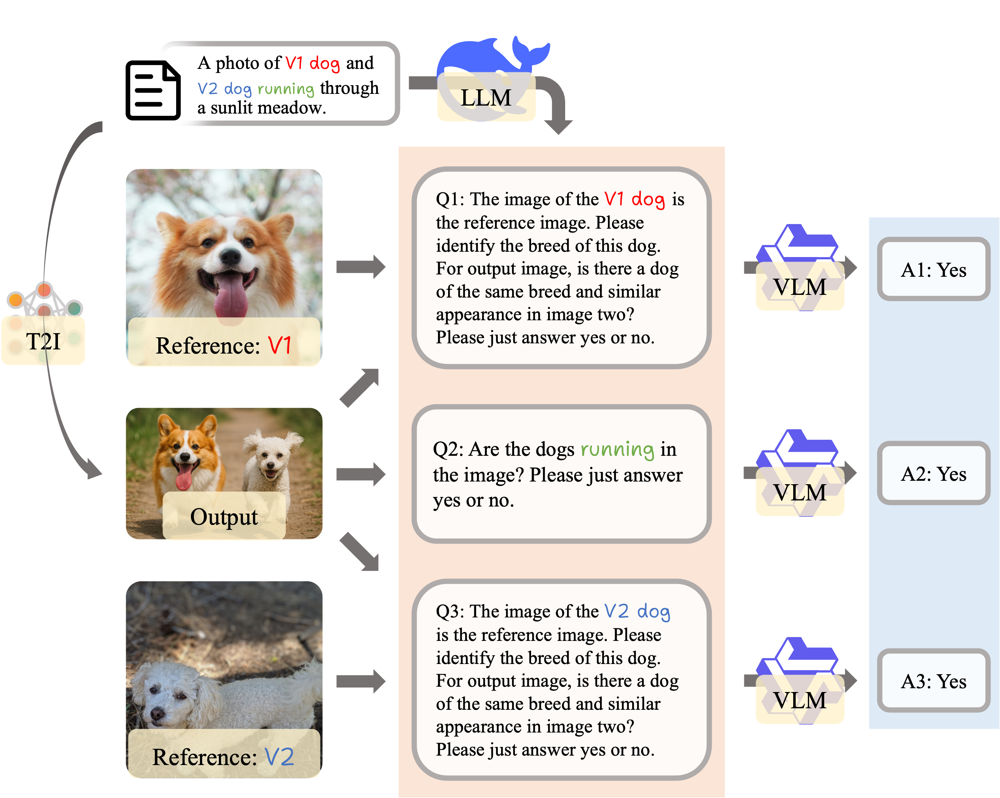

# Evaluation Pipeline of T2I-ConBench

<table align="center">
  <tr>
    <td align="center"> 
       
      <br>
      <em style="font-size: 18px;"><strong style="font-size: 18px;">Evaluation pipeline of cross-task generalization.</em>
    </td>
  </tr>
</table>

## 🔧 Dependencies and Installation
```bash
conda create -n t2i-conbench-eval python=3.9
conda activate t2i-conbench-eval

# FID 
pip install git+https://github.com/openai/CLIP.git
pip install git+https://github.com/boomb0om/text2image-benchmark

# HPS
pip install hpsv2

# Item & Cross
pip install transformers==4.51.3 accelerate
pip install qwen-vl-utils[decord] 
```

## 🔥 Evaluation

All data are placed in the following directory structure:

```
PATH_TO_DATA="your/path/to/data"

${PATH_TO_DATA}
│   ├─inference_results
│   │  ├─comp
│   │  ├─cross
│   │  └──...
│   ├─item
│   ├─domain
│   └─train_results
```

We use `seqft` as an example to demonstrate how to run the evaluation scripts.

1. **FID** on MS-COCO dataset

The input image files used for evaluation have the following structure:

```
fid
└─seqft
│   ├─items
│   ├─nature-body
│   └─nature-body-items
└──...
```

To run the FID evaluation, you can use the following command:
```bash
bash run/fid.sh
```

2. **Comp** by T2I-CompBench

We use [T2I-CompBench](https://github.com/Karine-Huang/T2I-CompBench) 3-in-1 for Complex Compositions.

3. **Unique-Sim** and **Class-Forget** for Sequential Item Customization

The input image files used for evaluation have the following structure:

```
item
└─seqft
│   ├─items
│   │  ├─0_p0h1_dog_dog
│   │  ├─1_k5f2_dog_dog3
│   │  ├─1_p0h1_dog_dog
│   │  └──...
│   ├─items-nature-body
│   │  ├─3_b9l1_sneaker_shiny_sneaker
│   │  ├─3_k5f2_dog_dog3
│   │  ├─3_p0h1_dog_dog
│   │  └──...
│   └──...
└──...
```

To run the Unique-Sim and Class-Forget evaluation, you can use the following command:
```bash
bash run/item.sh
```

The output files are formatted as a json file and a txt file named "result.json", "result.txt" in output folder.

4. **HPS** for Sequential Domain Enhancement

The input image files used for evaluation have the following structure:

```
domain
└─seqft
│   ├─nature
│   │  ├─nature
│   │  ├─body
│   ├─nature-body 
│   │  ├─nature
│   │  ├─body
│   ├─items-nature-body
│   │  ├─nature
│   │  ├─body
│   ├─nature-body-items 
│   │  ├─nature
│   │  ├─body
└──...
```

To run the HPS evaluation, you can use the following command:
```bash
bash run/hps.sh
```

The output files are formatted as two txt files for average HPS records and two files for detailed HPS records, respectively.

5. **Cross-task Generalization** for Sequential Item-Domain Adaptation

The input image files used for evaluation have the following structure:

```
cross
└─seqft
│   ├─items
│   │  └─item+item
│   ├─items-nature-body
│   │  ├─domain+domain
│   │  ├─item+body
│   │  ├─item+item
│   │  └─item+nature
│   ├─nature-body-items
│   │  ├─domain+domain
│   │  ├─item+body
│   │  ├─item+item
│   │  └─item+nature
│   └─nature-body
│       └─domain+domain
└──...
```

To run the Cross-task Generalization evaluation, you can use the following command:
```
bash run/cross.sh
```

The output files are formatted as a json file and a txt file named "result.json", "result.txt" in output folder.

## Acknowledgements
We would like to thank the following repositories:
- [T2I-Benchmark](https://github.com/boomb0om/text2image-benchmark)
- [HPS](https://github.com/lucidrains/hpsv2)
- [Qwen2.5-VL](https://github.com/QwenLM/Qwen2.5-VL)
