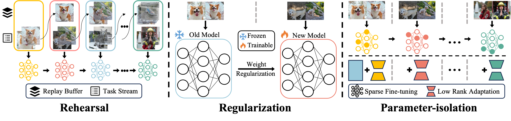

# Training Pipeline of T2I-ConBench

<table align="center">
  <tr>
    <td align="center"> 
       
      <br>
      <em style="font-size: 18px;"><strong style="font-size: 18px;">Overview of the continual post‑training baselines evaluated in this work, encompassing rehearsal‑based, regularization‑based, and parameter‑isolation methods (sparse fine‑tuning and low‑rank adaptation).</em>
    </td>
  </tr>
</table>

This document outlines the step-by-step process for training and generating images in T2I-ConBench.

## 🔧 Dependencies and Installation

### Method 1: Manual Installation
```bash
conda create -n t2i-conbench python=3.11 -y
conda activate t2i-conbench
pip install torch==2.3.0 torchvision==0.18.0 torchaudio==2.3.0 --index-url https://download.pytorch.org/whl/cu121
pip install -r requirements.txt
pip install git+https://github.com/huggingface/diffusers.git
```

### Method 2: Automated Installation Script
You can easily install all dependencies with our installation script:
```bash
bash install_requirements.sh
```

## 📂 Dataset Preparation

### 1. Process DreamBooth Dataset
```bash
bash run/process_dreambooth.sh
```
Prepares the item dataset for training.

### 2. Generate Item Prior
```bash
bash run/generate_prior.sh
```
Creates the prior class images for item customization tasks.

### 3. Process Domain Dataset
```bash
bash run/process_domain.sh
```
Prepares the domain dataset for training.

### 4. Extract T5 Features (Optional)
```bash
bash run/extract_t5_feature.sh
```
Extracts T5 text features of domain dataset.

### Final Dataset Structure
The final dataset structure should look like this:
```
your/path/to/data/
├── domain/
│   ├── data_info/
│   ├── nature/
│   ├── body/
│   ├── cross/
│   └── ...
└── item/
    ├── dog/
    ├── dog_prior_images/
    └── ...
```

## 🚀 Training and Generation

### Sequential Item Customization Training
```bash
bash run/run_item.sh
```

### Sequential Domain Enhancement Training
```bash
bash run/run_domain.sh
```

### Sequential Item-Domain Adaptation 
```bash
bash run/run_item-domain.sh
```

### Generate Images for Evaluation
We use `seqft` as an example to demonstrate how to run the inference scripts:

```bash
bash run/run_inference.sh
```

## 🙏 Acknowledgements
We would like to thank the following repositories for their contributions:
- [Diffusers Dreambooth Example](https://github.com/huggingface/diffusers/tree/main/examples/dreambooth)
- [PixArt-α](https://github.com/PixArt-alpha/PixArt-alpha)
